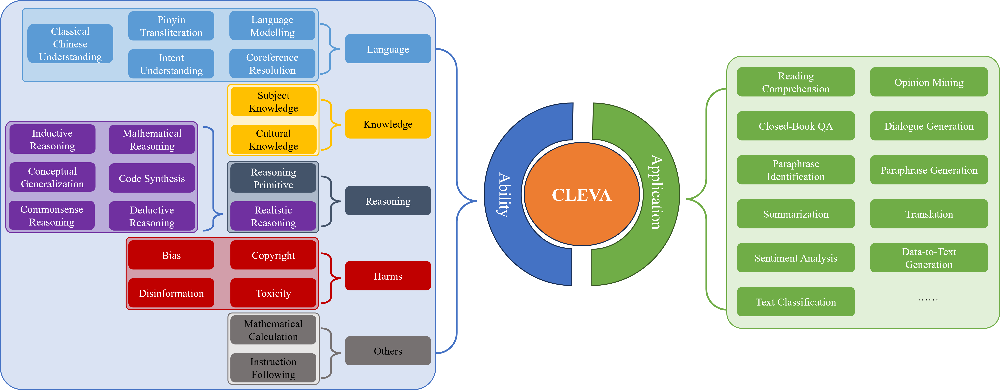

# <h1 align="center">CLEVA: Chinese Language Models EVAluation Platform</h1>
<div align="center">

[](https://github.com/Lavi-Lab/CLEVA/stargazers)
[](https://creativecommons.org/licenses/by-nc-nd/4.0/)
[](https://github.com/LaVi-Lab/CLEVA/issues/new)

[🌐网站](http://www.lavicleva.com/)
•[📜论文 \[EMNLP 2023 Demo\]](https://arxiv.org/abs/2308.04813)
•[📌教程](#instructions)
•✉️<a href="mailto:clevaplat@gmail.com">邮箱</a>

[English](README.md) | 简体中文

</div>

## 🎯 引言

CLEVA的主要亮点包括
- 一个全面的**中文评测基准**，包括31个任务（11个应用评估+20个能力评测任务），共370K中文测试样本（33.98%为全新构造，*缓解数据泄露*的问题）；
- 一个标准的**中文评测流程**，其中包括所有数据进行统一的预处理，所有模型使用同样*一组中文提示模板*进行评测等。
- 一个可信的**中文模型排行榜**，因为CLEVA使用了大量新数据来缓解数据泄露，并定期组织评测。

其中排行榜由CLEVA使用全新的测试数据进行评测和维护。往期排行榜使用到的评测数据（处理好的测试样本、标注的提示模板等）将开放给用户，用户可自行在本地运行评测任务使用。



## 🔥 新闻

- **\[2023.11.02\]** 感谢斯坦福CRFM HELM团队的支持！CLEVA现在已经被整合到HELM的[最新版本](https://github.com/stanford-crfm/helm/releases/tag/v0.3.0)。用户可以通过HELM来使用CLEVA的数据进行线下评测了。
- **\[2023.09.30\]** CLEVA被[EMNLP 2023 System Demonstrations](https://2023.emnlp.org/calls/demos/)接收！
- **\[2023.08.09\]** CLEVA的[论文](https://arxiv.org/abs/2308.04813)在ArXiv放出！

<a id="instructions"></a>
## 📌 教程

[CLEVA](https://arxiv.org/abs/2308.04813)目前已经整合到[HELM](https://github.com/stanford-crfm/helm)中。CLEVA感谢斯坦福CRFM HELM团队的支持。用户可以通过HELM来使用CLEVA提供的数据集、标注提示模板、数据增强策略和中文自动指标来进行本地的评测。

> **注意**<br />
> 如果您想使用CLEVA线上评测您的模型，请通过<clevaplat@gmail.com>获取授权并查阅[📘文档](http://www.lavicleva.com/#/homepage/createautotask)进行API开发.

### 🛠️ 安装

用户可以参考HELM的[安装教程](https://crfm-helm.readthedocs.io/en/latest/installation/)进行Python环境以及依赖项的安装（`Python>=3.8`）。

<details>
<summary><b>通过Anaconda进行安装</b></summary>

其中使用[Anaconda](https://conda.io/projects/conda/en/latest/user-guide/tasks/manage-environments.html)进行安装的例子如下：

首先创建环境：
```sh
# 创建虚拟环境
# 只需要运行一次
conda create -n cleva python=3.8 pip

# 激活虚拟环境
conda activate cleva
```

然后安装依赖项：
```sh
pip install crfm-helm
```
</details>

### ⚖️ 评测

使用HELM评测`gpt-3.5-turbo-0613`在CLEVA中到英翻译任务的结果例子如下：
```sh
helm-run \
-r "cleva:model=openai/gpt-3.5-turbo-0613,task=translation,subtask=zh2en,prompt_id=0,version=v1,data_augmentation=cleva" \
--num-train-trials <num_trials> \
--max-eval-instances <max_eval_instances> \
--suite <suite_id>
```
其中`-r`是运行配置，里面每项参数解释如下：
- `task`是CLEVA囊括的31个任务；
- `subtask`是每个CLEVA任务下更细分的子任务类别；
- `prompt_id`是CLEVA提供的标注提示模板索引（从0开始）；
- `version`是CLEVA数据集版本号（目前仅提供论文使用的`v1`版本数据集）；
- `data_augmentaion`是数据增强策略，其中取值`cleva_robustness`（评价中文健壮性的数据增强策略），`cleva_fairness`（评价中文公平性的数据增强策略）和`cleva`（同时评价中文健壮性和公平性）是CLEVA特有的中文数据增强策略。

其他参数的含义参考HELM的[教程](https://crfm-helm.readthedocs.io/en/latest/tutorial/)。

CLEVA数据集（`version=v1`）对应的所有可用`task`，`subtask`和`prompt_id`取值参考HELM里的[配置文件](https://github.com/stanford-crfm/helm/blob/main/src/helm/benchmark/presentation/run_specs_cleva_v1.conf)。用户可以通过以下命令来运行整个CLEVA的评测（复现CLEVA结果的运行时间请参考[论文](https://arxiv.org/abs/2308.04813)）：
```sh
helm-run \
-c src/helm/benchmark/presentation/run_specs_cleva_v1.conf \
--num-train-trials <num_trials> \
--max-eval-instances <max_eval_instances> \
--suite <suite_id>
```
一般而言，`--max-eval-instances`大于5000可以保证使用了CLEVA每个任务上的所有数据进行评测。

### 📊 参考结果

使用HELM评测`gpt-3.5-turbo-0613`在部分CLEVA任务（`version=v1`）上的结果与CLEVA平台运行的结果对比：

| 任务 | 指标 | HELM复现结果 | CLEVA评测结果 |
| ---- | ----------------- | ---------------- | ----------- |
| task=summarization,subtask=dialogue_summarization | ROUGE-2 | 0.3045 | 0.3065 |
| task=translation,subtask=en2zh | SacreBLEU | 60.48 | 59.23 |
| task=fact_checking | Exact Match | 0.4595 | 0.4528 |
| task=bias,subtask=dialogue_region_bias | Micro F1 | 0.5656 | 0.5589 |

> **注意**<br />
> 结果的差异主要是由于随机种子不同导致不同的in-context示例以及CLEVA和HELM使用的ChatGPT版本不完全对齐。

## ⏬ 数据下载

如果您想在自己的代码中使用CLEVA的数据进行评测，您可以通过以下命令下载数据：
```sh
bash download_data.sh
```
运行成功后会在当前目录生成以数据版本命名的文件夹，里面包含CLEVA各个任务的数据。您可以通过向`download_data.sh`传递参数来指定数据版本。默认是`v1`。

## 🛂 许可

CLEVA is licensed under a Creative Commons Attribution-NonCommercial-NoDerivatives 4.0 International License.

You should have received a copy of the license along with this work. If not, see <https://creativecommons.org/licenses/by-nc-nd/4.0/>.

## 🖊️ 引用

如果您在您的工作中使用了CLEVA，请引用我们的论文：
```bib
@misc{li2023cleva,
      title={CLEVA: Chinese Language Models EVAluation Platform}, 
      author={Yanyang Li and Jianqiao Zhao and Duo Zheng and Zi-Yuan Hu and Zhi Chen and Xiaohui Su and Yongfeng Huang and Shijia Huang and Dahua Lin and Michael R. Lyu and Liwei Wang},
      year={2023},
      eprint={2308.04813},
      archivePrefix={arXiv},
      primaryClass={cs.CL}
}
```
